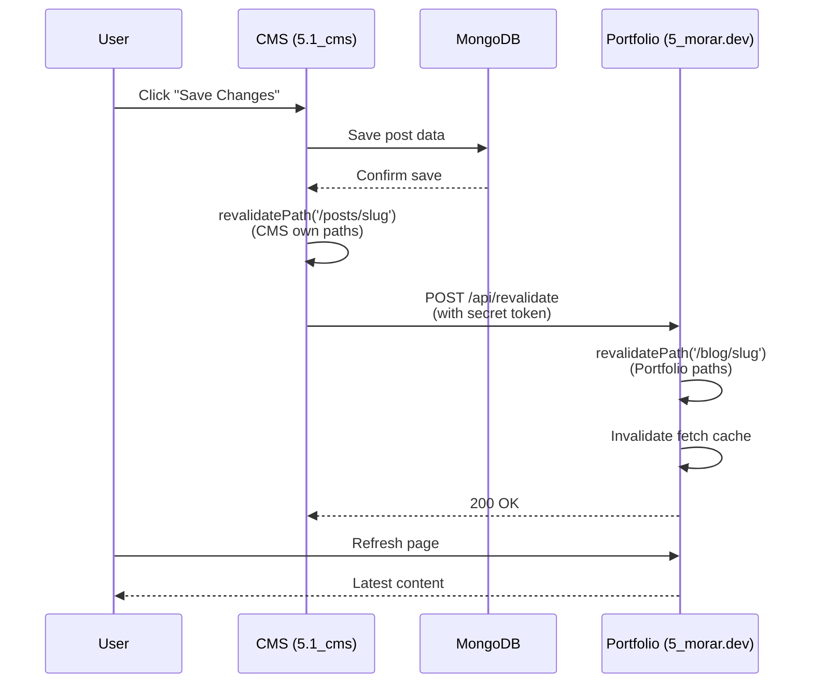

# Fix CMS Revalidation for Por

tfolio Site

## Current Problem Analysis

### How Revalidation Currently Works (and Why It's Broken)

1. **CMS App (5.1_cms)**:

- When a post is saved, `revalidatePost` hook in [`src/collections/Posts/hooks/revalidatePost.ts`](src/collections/Posts/hooks/revalidatePost.ts) calls `revalidatePath('/posts/${doc.slug}')`
- This only revalidates paths **within the CMS app itself** (localhost:3001 or cms.morar.dev)
- The CMS and portfolio site are **separate Next.js applications** - they don't share cache

2. **Portfolio Site (5_morar.dev)**:

- Uses **ISR (Incremental Static Regeneration)** with `revalidate = 3600` (1 hour cache)
- Fetches data from CMS API: `PAYLOAD_CMS_URL` (defaults to `https://cms.morar.dev`)
- Has **no mechanism** to know when CMS content changes
- Only updates automatically every hour

3. **The Gap**:

- CMS revalidates: `cms.morar.dev/posts/slug` ✅
- Portfolio needs: `morar.dev/blog/slug` ❌ (not notified)
- Portfolio uses ISR cache: waits up to 1 hour for changes

## Solution: On-Demand Revalidation

### Architecture Flow




### Implementation Steps

#### 1. Create Revalidation API Route in Portfolio Site

**File**: `/Users/apple/Projects/5_morar.dev/app/api/revalidate/route.ts`

- Accept POST requests with secret token
- Validate token against environment variable
- Accept `path` and `tag` parameters
- Call `revalidatePath()` and/or `revalidateTag()` for portfolio paths
- Return appropriate status codes

#### 2. Update CMS Revalidation Hook

**File**: `/Users/apple/Projects/5.1_cms/src/collections/Posts/hooks/revalidatePost.ts`

- After local revalidation, make HTTP request to portfolio site's revalidation API
- Map CMS paths to portfolio paths:
- `/posts/slug` → `/blog/slug`
- Include secret token in request
- Handle errors gracefully (log but don't fail save operation)

#### 3. Environment Variables

**CMS (.env.local)**:

- `PORTFOLIO_REVALIDATE_URL`: Portfolio site's revalidation endpoint
- `PORTFOLIO_REVALIDATE_SECRET`: Shared secret token

**Portfolio (.env.local)**:

- `REVALIDATE_SECRET`: Same secret token for validation

#### 4. Update Fetch Cache Strategy

**File**: `/Users/apple/Projects/5_morar.dev/lib/blog.ts`

- Keep ISR as fallback (`revalidate: 3600`)
- On-demand revalidation will invalidate cache immediately
- Consider adding cache tags for more granular invalidation

## Professional Approach: Headless CMS with Next.js

### 3.1 What Should Happen on "Save Changes"

**Current (Broken)**:

1. ✅ Save to database
2. ✅ Revalidate CMS app paths
3. ❌ Portfolio site not notified (waits up to 1 hour)

**Professional Approach**:

1. ✅ Save to database
2. ✅ Revalidate CMS app paths (for CMS preview)
3. ✅ **Trigger on-demand revalidation** for all dependent sites
4. ✅ **Invalidate related caches** (post list, tags, categories)
5. ✅ **Return success** only after all revalidations complete (or timeout)

### 3.2 Static vs Incremental vs On-Demand

**Static Site Generation (SSG)**:

- ❌ **Not suitable**: Requires full rebuild on every change
- ❌ Slow deployment, no instant updates

**Incremental Static Regeneration (ISR)** - Current:

- ✅ **Good for**: Background updates, fallback
- ✅ Fast initial load, cached responses
- ❌ **Problem**: Up to 1-hour delay (your current issue)
- ✅ **Solution**: Combine with on-demand revalidation

**On-Demand Revalidation** - Recommended:

- ✅ **Best for**: Immediate updates after CMS changes
- ✅ Instant content updates
- ✅ Works with ISR as fallback
- ✅ Professional standard for headless CMS

**Hybrid Approach (Recommended)**:

- **Primary**: On-demand revalidation (immediate updates)
- **Fallback**: ISR with reasonable cache time (60-300 seconds)
- **Benefits**: Instant updates + resilience if webhook fails

## Implementation Details

### Revalidation API Route Structure

```typescript
// app/api/revalidate/route.ts
export async function POST(request: Request) {
  // 1. Verify secret token
  // 2. Parse body (path, tag, collection)
  // 3. Map CMS paths to portfolio paths
  // 4. Call revalidatePath/revalidateTag
  // 5. Return success/error
}
```


### CMS Hook Enhancement

```typescript
// After revalidatePath for CMS
if (process.env.PORTFOLIO_REVALIDATE_URL) {
  await fetch(`${process.env.PORTFOLIO_REVALIDATE_URL}`, {
    method: 'POST',
    headers: { 'Content-Type': 'application/json' },
    body: JSON.stringify({
      secret: process.env.PORTFOLIO_REVALIDATE_SECRET,
      path: `/blog/${doc.slug}`, // Map to portfolio path
      tag: 'posts',
    }),
  });
}
```


### Path Mapping

- CMS: `/posts/slug` → Portfolio: `/blog/slug`
- CMS: `/posts` → Portfolio: `/blog` (for list pages)
- CMS: `/` → Portfolio: `/` (home page)

## Testing Strategy

1. **Local Development**:

- Test with `localhost:3000` as portfolio URL
- Verify revalidation logs in both apps
- Check cache invalidation

2. **Production**:

- Use production URLs
- Monitor webhook success/failure rates
- Set up alerts for failed revalidations

## Additional Considerations

- **Error Handling**: Don't fail save operation if revalidation fails (log error)
- **Retry Logic**: Consider retry mechanism for failed webhooks
- **Security**: Use strong secret tokens, validate on both ends